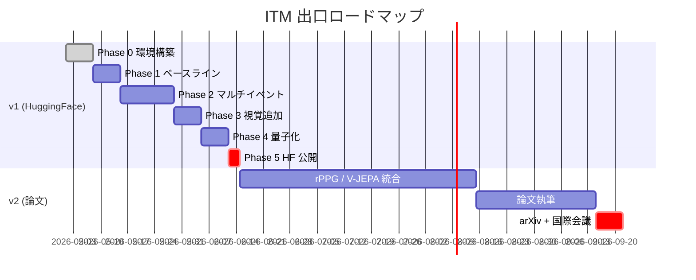

# プロジェクト概要

> **Status**: stable | **Last reviewed**: 2026-05-16
>
> なぜ ITM をやるのか、どんな出口を狙うのか。
>
> **前提語彙**: 専門用語は最小限にとどめている。AMI（学習に使う公開会議録音）、
> VAP / Smart Turn / MaAI（比較対象の既存モデル）が初耳なら、
> [トップページの「用語の最小セット」](../index.md#用語の最小セット) を 1 分で見てから戻ってきてほしい。

## なぜ「相手が話そうとしている瞬間」を予測したいのか

人間の自然な会話では、話者交代は約 **200ms** という極めて短いギャップで起きる (Stivers et al. 2009)。これは音声認識結果が出てから判断していたら間に合わない時間軸であり、人間は相手の **発声前** の視覚・音声・文脈手がかりから次の話者を推定している。

現在の音声 AI（音声アシスタント、ビデオ会議システム）はこれが致命的に下手である。

- 「もう話し終わった」と判断するのに 700〜1000ms の沈黙を待つため、応答が常に不自然に遅い
- ユーザーが「えーと」と考え込むだけで AI が割り込んでしまう
- バックチャネル（「うん」「なるほど」）と本格的な発話を区別できない

これらは「**発声前に**、**何のイベントが**、**いつ**起きるか」を予測すれば解決する課題である。

## このプロジェクトの位置づけ

ターンテイキング予測は学術的に活発な領域で、特に 2022 年の VAP (Voice Activity Projection) 以降、自己教師あり学習による高精度モデルが続々と登場している。しかし以下の課題が残っている:

| 課題 | 代表的な既存モデル | 既存の状態 | 我々の方針 |
|---|---|---|---|
| 単一二値出力 | **VAP** (Ekstedt 2022) / **Smart Turn v3** (Pipecat) | 「次に喋るか / 喋らないか」だけ | **3 イベント同時予測**: 話者交代 / 相づち / 割り込み |
| エッジで動かない | **Moshi** (Kyutai、7B) / **DualTurn** (0.5B) | サーバ GPU 前提 | **< 10M params**、CPU でリアルタイム |
| 視覚モダリティ不足 | **MM-VAP** (Skantze 2024) | 英語のみ・研究室実装 | **顔特徴 + 呼吸プロキシ**を寛容ライセンス OSS で |
| 接触型センサ前提 | **Obi & Funakoshi** (ICMI 2023 / IWSDS 2025) | 呼吸ベルトまたは 3DCNN 直接回帰 | **rPPG / 顔 micro-motion** で非接触化 |

各既存モデルの詳細は [既存モデル](../research/existing-models.md)、差別化マトリクスは [新規性](../design/novelty.md)。

## 著者の動機

- **趣味の研究**: アカデミック所属なし、購入予算なし、A100 × 48h 程度の計算資源
- **論文書きより先に動くもの**: HuggingFace + GitHub 先行リリースで、コミュニティに使ってもらってから査読論文を狙う
- **マルチモーダル + 生理学的洞察 + エッジ最適化** という分野横断のおもしろさ

## 出口イメージ

## 関連ページ

- [解く問題](problem.md) — 問題設定の精密な定義
- [ロードマップ](roadmap.md) — Phase 別の詳細計画
- [新規性](../design/novelty.md) — 既存研究との差別化
