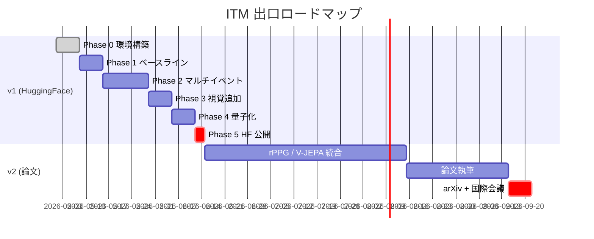

# プロジェクト概要

> **Status**: stable | **Last reviewed**: 2026-05-09
>
> なぜ ITM をやるのか、どんな出口を狙うのか。

## なぜ「相手が話そうとしている瞬間」を予測したいのか

人間の自然な会話では、話者交代は約 **200ms** という極めて短いギャップで起きる (Stivers et al. 2009)。これは音声認識結果が出てから判断していたら間に合わない時間軸であり、人間は相手の **発声前** の視覚・音声・文脈手がかりから次の話者を推定している。

現在の音声 AI（音声アシスタント、ビデオ会議システム）はこれが致命的に下手である。

- 「もう話し終わった」と判断するのに 700〜1000ms の沈黙を待つため、応答が常に不自然に遅い
- ユーザーが「えーと」と考え込むだけで AI が割り込んでしまう
- バックチャネル（「うん」「なるほど」）と本格的な発話を区別できない

これらは「**発声前に**、**何のイベントが**、**いつ**起きるか」を予測すれば解決する課題である。

## このプロジェクトの位置づけ

ターンテイキング予測は学術的に活発な領域で、特に 2022 年の VAP (Voice Activity Projection) 以降、自己教師あり学習による高精度モデルが続々と登場している。しかし以下の課題が残っている:

| 課題 | 既存研究の現状 | 我々の方針 |
|---|---|---|
| 単一二値出力 | VAP / Smart Turn は「話す/話さない」のみ | **マルチイベント** (turn-shift / backchannel / overlap) 同時予測 |
| エッジで動かない | Moshi (7B) や DualTurn (0.5B) はサーバ級 | **< 10M params、CPU リアルタイム** |
| 視覚モダリティの統合不足 | MM-VAP は試みているが英語のみ、研究室実装 | **顔のみで呼吸を含む発話準備動作を統合** |
| 接触型センサ前提 | Obi & Funakoshi (IWSDS 2025) は呼吸ベルト | **rPPG / 顔 micro-motion で非接触化** |

## 著者の動機

- **趣味の研究**: アカデミック所属なし、購入予算なし、A100 × 48h 程度の計算資源
- **論文書きより先に動くもの**: HuggingFace + GitHub 先行リリースで、コミュニティに使ってもらってから査読論文を狙う
- **マルチモーダル + 生理学的洞察 + エッジ最適化** という分野横断のおもしろさ

## 出口イメージ

## 関連ページ

- [解く問題](problem.md) — 問題設定の精密な定義
- [ロードマップ](roadmap.md) — Phase 別の詳細計画
- [新規性](../design/novelty.md) — 既存研究との差別化
