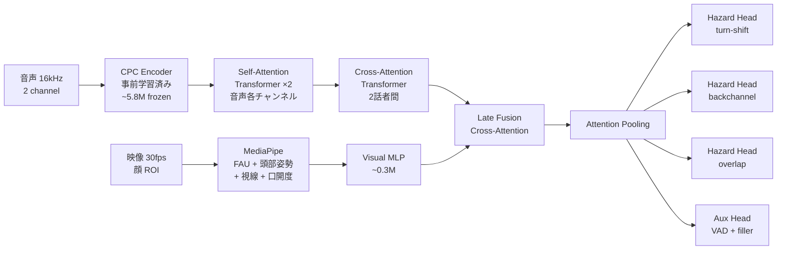

# v1 アーキテクチャ

> **Last reviewed**: 2026-05-16
>
> **先行モデルと並べて見たい場合は** [先行モデルとの実装差分](#先行モデルとの実装差分) に飛ぶ。

> **Status**: draft | **Last reviewed**: 2026-05-09
>
> ITM v1（HuggingFace 公開向け）の設計判断とアーキテクチャ。

## TL;DR

- **ベース**: MaAI (`maai-kyoto/maai`) の VAP 実装に乗る
- **拡張**: 単一二値出力を **マルチイベント・サバイバルハザード** に置換（turn-shift / backchannel / overlap）
- **視覚**: MediaPipe 顔特徴の後期融合
- **量子化**: Smart Turn v3 の int8 static QAT 方式を踏襲
- **学習データ**: AMI Corpus（メイン）+ Smart Turn v3.1 (filler 補助)
- **目標**: < 15M params、CPU リアルタイム

## 全体像



## コンポーネント詳細

### 音声エンコーダ（VAP 踏襲）

- CPC エンコーダ (5層 CNN + GRU)、LibriSpeech 事前学習済み、**フリーズ**
- 各チャンネル独立に Self-Attention Transformer
- Cross-Attention Transformer で 2 話者の相互作用
- これは MaAI の VAP 実装をそのまま使う

### 視覚エンコーダ

- **MediaPipe Face Mesh**（CPU 5ms/frame）でランドマーク・FAU 抽出
- 視覚特徴ベクトル（FAU 17 + 頭部 3 + 視線 6 + 口開度 1 = 27 次元）を 30fps で取得
- 軽量 MLP（次元 128）でエンコード
- **学習対象**

### 後期融合

- 音声 (50Hz) と視覚 (30Hz) を 50Hz 共通グリッドにアップ/ダウンサンプル
- Cross-Attention で音声の hidden state を query、視覚を key/value
- 視覚モダリティ欠損時もロバスト（モダリティドロップアウト学習）

### マルチイベント・ハザード head

3 つの独立した sigmoid ハザード head:

```python
# 各 e ∈ {turn, bc, overlap}, 各 horizon k ∈ {0..39} に対し
h_e[t, k] = sigmoid(MLP_e(hidden[t]))[k]
```

各 horizon は 50ms きざみで 2 秒先まで（40 bins）。詳細は [マルチイベント・ハザード](multi-event-hazard.md)。

### 補助 head (auxiliary tasks)

- 自分・相手の VAD（マルチタスク学習で hidden state を整える）
- midfiller / endfiller 検出（Smart Turn データ活用）

## 損失関数

```
L = Σ_e L_survival_e(NLL)        # 主損失：discrete-time hazard NLL
  + λ_VAD · L_VAD                  # VAD 補助
  + λ_filler · L_filler            # filler 補助
  + λ_calib · L_calibration        # ECE
  + λ_disambig · L_event_disambig  # イベント間の混同抑制
  + λ_modal · L_modality_consist   # モダリティドロップアウト一貫性
```

詳細は [マルチイベント・ハザード](multi-event-hazard.md)。

## 計算量見積もり

| コンポーネント | パラメータ | 学習対象 | CPU 推論コスト/frame |
|---|---|---|---|
| CPC Encoder | 5.8M | フリーズ | ~25 MFLOP |
| Self-Attention ×2 | ~3M | ✓ | ~15 MFLOP |
| Cross-Attention | ~2M | ✓ | ~10 MFLOP |
| Visual MLP + Fusion | ~0.5M | ✓ | ~5 MFLOP |
| Hazard Heads ×3 + Aux | ~0.5M | ✓ | ~negligible |
| **計** | **~12M (学習対象 6M)** | | **~55 MFLOP/frame** |

10Hz 動作で 550 MFLOP/sec。M4 単コアの 200 GFLOPS 余裕で収まる。int8 量子化で更に 4x。

## 学習レシピ

### Phase 別計画


合計 48 時間で v1 完成を目指す。

### 学習設定（VAP 標準を踏襲）

- Optimizer: AdamW
- 学習率: 3.63e-4
- Weight decay: 0.001
- バッチサイズ: 8（gradient accumulation で実効 32）
- LR スケジューラ: ReduceLROnPlateau
- Mixed precision (bf16)

## 評価指標

| 指標 | 既存比較対象 |
|---|---|
| Per-event Hazard AUC | VAP, MM-VAP, Easy Turn |
| Lead Time @ FPR=5% | DualTurn (vs 220ms) |
| Confusion Matrix | Easy Turn (4-state) |
| Brier Score / ECE | — (我々の追加) |
| CPU Inference (M4) | Smart Turn v3 (12ms) |

## 先行モデルとの実装差分

Real-time VAP / MM-VAP / Smart Turn v3 と ITM のアーキテクチャを実装レベルで並べる。MaAI ソース (`.venv/lib/python3.11/site-packages/maai/`) と本リポジトリの `src/itm/models/itm_model.py` から確認した実数値。

### 共通ベース: VAP 系の構造

Real-time VAP / MM-VAP / ITM v1 はいずれも **同じ VAP backbone** を共有する。MaAI 実装の `VapGPT` クラス (`maai/models/vap.py`):

```
audio (B, 1, T_samples) per channel
    │
    │   ──[ ch1 ]──┐
    │              │  CPC encoder (LibriSpeech pretrained, 凍結)
    │   ──[ ch2 ]──┤  → 50 Hz 特徴 (B, T_enc, dim=256)
    │              ▼
    ├── ar_channel(x1) ──┐   # 自己注意 GPT, 1 層, dim=256, 4 heads
    ├── ar_channel(x2) ──┤
    │                    ▼
    └── ar(o1, o2) ──────┐   # 交差注意 GPTStereo, 3 層, dim=256, 4 heads
                         ▼
                hidden h ∈ (B, T_enc, 256)
                         │
                         ├──→ va_classifier: Linear(256, 1) per channel  (VAD)
                         └──→ vap_head: Linear(256, 256)                   (VAP)
```

VAP の出力 256 は **`2^8` = 2 speakers × 4 future bins** の組合せパターン総数。bin_times は MaAI で `[0.2, 0.4, 0.6, 0.8]` sec、つまり 0.8 秒先までを 4 ステップで離散化。softmax で 256 クラスに分布、それを集約して `p_now` / `p_future`（次に喋る話者の確率）を二値で出す。

### 4 系統の実装差分

| 観点 | Real-time VAP (MaAI) | MM-VAP | Smart Turn v3 | **ITM v1 / v4** |
|---|---|---|---|---|
| **音声 encoder** | CPC (5 層 CNN + 状態 GRU) | 同左 | **Whisper Tiny encoder** (別系統) | CPC（MaAI 共有） |
| **per-channel** | GPT 1 層 × 2 ch | 同左 | 単一ストリーム | GPT 1 層 × 2 ch（MaAI 共有） |
| **cross-channel** | GPTStereo 3 層 | 同左 | なし（単一） | GPTStereo 3 層（MaAI 共有） |
| **視覚 encoder** | なし | MediaPipe FAU + 視線 + 頭部姿勢 (∼27 dim) → 軽量 MLP | なし | （v2 で MediaPipe Face Mesh 追加予定） |
| **視覚融合点** | — | 交差注意で hidden h に late fusion | — | 同じ late fusion 方式を計画 |
| **出力 head** | `vap_head`: Linear(256, **256**)、softmax 1 個 | 同左 | Linear(d, **1**)、sigmoid 1 個 | `hazard_heads`: 3 × MLP(256→128→**40**)、sigmoid 独立 + `shift_head` (v4): MLP(256→128→**1**) |
| **未来表現** | 4 bin × 2 ch = **8 スロット**を `2^8=256` パターンに enum | 同左 | 「次 ∼200ms に喋るか」の 1 点 | event ごとに **40 bin × 50ms = 0–2 sec** の連続ハザード |
| **イベント区別** | なし（次話者の二値） | なし | なし | **turn-shift / backchannel / overlap** 独立 head |
| **学習目的** | 256 クラス cross-entropy + VAD BCE | 同左 + 視覚補助 (詳細未公開) | 二値 BCE | **多イベント survival NLL** + VAD BCE + (v4) per-silence shift BCE |
| **frame_hz (output)** | 10 / 20 (config) | 同左 | 不明 (~50 Hz 推測) | **50 Hz**（encoder native rate を直接使用） |
| **量子化** | なし | なし | **int8 static QAT** | 計画中 (Phase 4) |
| **params** | ~12M | ~30M (推測) | **8M** | ~8M (v4, hazard heads + shift_head = 149K trainable) |

### 何が物理的に違うのか

#### 1. **出力空間の表現**

- **VAP 系 (Real-time VAP / MM-VAP)**: 「次 0.8 秒の 2 話者の発話パターン」を `2^8=256` 個の列挙に押し込む。新しいイベントを足したくても 256 を変更すると pretrain を引き継げない。
- **Smart Turn v3**: 「次の 200ms に喋るか」のスカラーひとつ。シンプルで calibration しやすいが、shift / backchannel / overlap を区別できない。
- **ITM**: イベント別に独立な sigmoid hazard を出す。新イベントは新しい head を足すだけ（pretrain backbone を再利用可能）。50ms 粒度 × 40 bin で **「いつ起きるか」も連続値**として扱える。

#### 2. **encoder の選択**

- VAP 系と ITM は **CPC**（教師なし学習音声表現、約 12M params）を共有。LibriSpeech だけで学習されているため AMI への転移は完璧ではないが、frozen で使うとサイズ・推論コストが小さい。
- Smart Turn v3 は **Whisper Tiny**（39M、教師あり、多言語）を encoder にして言語非依存性を取った。代わりに per-channel + cross-channel の話者対話モデリングは捨てている（単一混合ストリーム）。

#### 3. **学習の単位**

- VAP は **chunk 全体の 256 パターン分類**を CE で学習。陽性クラスが偏らない（256 分割なのでだいたい均等）。
- Smart Turn は **frame 単位の二値 BCE**。陽性が稀（unbalanced）。
- ITM survival NLL は **frame × bin** で陽性は超スパース（イベント発生時のみ 1）→ クラス不均衡が深刻 → `pos_weight` で補正必要だった経緯（Phase 2-B v1 〜 v3 の失敗）。これが v4 で **per-silence segment 単位の BCE** (shift_head 専用) を追加する動機。

#### 4. **MM-VAP の視覚融合と ITM の方針の違い**

- MM-VAP は FAU + 視線 + 頭部姿勢を 1 つの視覚 encoder にまとめて、cross-attention で hidden h と late fusion。性能向上は hold/shift 79% → 84% (Switchboard)。
- ITM v2 は同じ MediaPipe 特徴セットを採用するが、**呼吸プロキシ (rPPG / 顔 micro-motion)** を 3 経路目として追加する点が新規。MM-VAP は呼吸を扱わない。

### 検証可能な参照

| 主張 | 出典 |
|---|---|
| MaAI = Real-time VAP の実装 | [既存モデル](../research/existing-models.md#real-time-vap-inoue-et-al-iwsds-2024), `maai/models/vap.py` |
| VAP の 256 = 2^(2×4) | `.venv/lib/python3.11/site-packages/maai/objective.py:85` (`n_classes = 2 ** total_bins`)、`bin_times=[0.2,0.4,0.6,0.8]` |
| ITM の hazard head 構造 | `src/itm/models/itm_model.py:107` (LayerNorm → Linear → GELU → Linear) |
| ITM の shift_head (v4) | `src/itm/models/itm_model.py:136` (`enable_shift_head=True` 時のみ) |
| Smart Turn v3 = Whisper Tiny + int8 QAT | [既存モデル](../research/existing-models.md#smart-turn-v3-pipecat-ai) |

## 過去の判断（破棄）

参考までに、検討して採用しなかった設計を残す:

- ~~Coupled-Mamba 融合~~: 公式実装の安定性が未確認、v2 に延期
- ~~V-JEPA 2.1 蒸留視覚エンコーダ~~: 学習コストが A100×48h を圧迫、v2 に延期
- ~~rPPG ベースの呼吸エンコーダ~~: v2 で追加（信頼性確保のため）
- ~~Smart Turn データを turn-shift 学習に流用~~: データの実体は単一話者 endpoint で AMI に変更
- ~~ErikEkstedt/VoiceActivityProjection 直接 fork~~: 依存劣化のため MaAI に変更

## 関連ページ

- [マルチイベント・ハザード](multi-event-hazard.md) — 出力定式化の詳細
- [ラベル生成](label-generation.md) — AMI dialog act → ITM event
- [データ戦略](data-strategy.md) — どのデータをどう使うか
- [新規性](novelty.md) — 既存研究との差別化
- [既存モデル](../research/existing-models.md) — VAP / MM-VAP / Smart Turn の詳細
