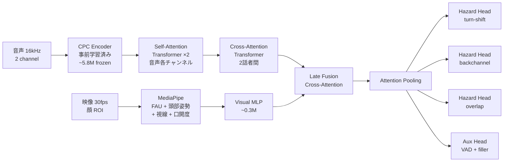

# v1 アーキテクチャ

> **Status**: draft | **Last reviewed**: 2026-05-09
>
> ITM v1（HuggingFace 公開向け）の設計判断とアーキテクチャ。

## TL;DR

- **ベース**: MaAI (`maai-kyoto/maai`) の VAP 実装に乗る
- **拡張**: 単一二値出力を **マルチイベント・サバイバルハザード** に置換（turn-shift / backchannel / overlap）
- **視覚**: MediaPipe 顔特徴の後期融合
- **量子化**: Smart Turn v3 の int8 static QAT 方式を踏襲
- **学習データ**: AMI Corpus（メイン）+ Smart Turn v3.1 (filler 補助)
- **目標**: < 15M params、CPU リアルタイム

## 全体像



## コンポーネント詳細

### 音声エンコーダ（VAP 踏襲）

- CPC エンコーダ (5層 CNN + GRU)、LibriSpeech 事前学習済み、**フリーズ**
- 各チャンネル独立に Self-Attention Transformer
- Cross-Attention Transformer で 2 話者の相互作用
- これは MaAI の VAP 実装をそのまま使う

### 視覚エンコーダ

- **MediaPipe Face Mesh**（CPU 5ms/frame）でランドマーク・FAU 抽出
- 視覚特徴ベクトル（FAU 17 + 頭部 3 + 視線 6 + 口開度 1 = 27 次元）を 30fps で取得
- 軽量 MLP（次元 128）でエンコード
- **学習対象**

### 後期融合

- 音声 (50Hz) と視覚 (30Hz) を 50Hz 共通グリッドにアップ/ダウンサンプル
- Cross-Attention で音声の hidden state を query、視覚を key/value
- 視覚モダリティ欠損時もロバスト（モダリティドロップアウト学習）

### マルチイベント・ハザード head

3 つの独立した sigmoid ハザード head:

```python
# 各 e ∈ {turn, bc, overlap}, 各 horizon k ∈ {0..39} に対し
h_e[t, k] = sigmoid(MLP_e(hidden[t]))[k]
```

各 horizon は 50ms きざみで 2 秒先まで（40 bins）。詳細は [マルチイベント・ハザード](multi-event-hazard.md)。

### 補助 head (auxiliary tasks)

- 自分・相手の VAD（マルチタスク学習で hidden state を整える）
- midfiller / endfiller 検出（Smart Turn データ活用）

## 損失関数

```
L = Σ_e L_survival_e(NLL)        # 主損失：discrete-time hazard NLL
  + λ_VAD · L_VAD                  # VAD 補助
  + λ_filler · L_filler            # filler 補助
  + λ_calib · L_calibration        # ECE
  + λ_disambig · L_event_disambig  # イベント間の混同抑制
  + λ_modal · L_modality_consist   # モダリティドロップアウト一貫性
```

詳細は [マルチイベント・ハザード](multi-event-hazard.md)。

## 計算量見積もり

| コンポーネント | パラメータ | 学習対象 | CPU 推論コスト/frame |
|---|---|---|---|
| CPC Encoder | 5.8M | フリーズ | ~25 MFLOP |
| Self-Attention ×2 | ~3M | ✓ | ~15 MFLOP |
| Cross-Attention | ~2M | ✓ | ~10 MFLOP |
| Visual MLP + Fusion | ~0.5M | ✓ | ~5 MFLOP |
| Hazard Heads ×3 + Aux | ~0.5M | ✓ | ~negligible |
| **計** | **~12M (学習対象 6M)** | | **~55 MFLOP/frame** |

10Hz 動作で 550 MFLOP/sec。M4 単コアの 200 GFLOPS 余裕で収まる。int8 量子化で更に 4x。

## 学習レシピ

### Phase 別計画

```mermaid
gantt
    title v1 学習段取り (A100 × 48h 予算内)
    dateFormat  HH
    section Phase 1
    AMI ダウンロード+前処理         :p1, 00, 6h
    MaAI VAP ベースライン推論       :p2, after p1, 4h
    section Phase 2
    マルチイベントラベル生成        :p3, after p2, 4h
    Hazard heads 単独 fine-tune     :p4, after p3, 12h
    section Phase 3
    視覚特徴抽出 (MediaPipe)        :p5, after p4, 4h
    視覚 fusion 学習                :p6, after p5, 12h
    section Phase 4
    ONNX export + int8 QAT          :p7, after p6, 6h
```



合計 48 時間で v1 完成を目指す。

### 学習設定（VAP 標準を踏襲）

- Optimizer: AdamW
- 学習率: 3.63e-4
- Weight decay: 0.001
- バッチサイズ: 8（gradient accumulation で実効 32）
- LR スケジューラ: ReduceLROnPlateau
- Mixed precision (bf16)

## 評価指標

| 指標 | 既存比較対象 |
|---|---|
| Per-event Hazard AUC | VAP, MM-VAP, Easy Turn |
| Lead Time @ FPR=5% | DualTurn (vs 220ms) |
| Confusion Matrix | Easy Turn (4-state) |
| Brier Score / ECE | — (我々の追加) |
| CPU Inference (M4) | Smart Turn v3 (12ms) |

## 過去の判断（破棄）

参考までに、検討して採用しなかった設計を残す:

- ~~Coupled-Mamba 融合~~: 公式実装の安定性が未確認、v2 に延期
- ~~V-JEPA 2.1 蒸留視覚エンコーダ~~: 学習コストが A100×48h を圧迫、v2 に延期
- ~~rPPG ベースの呼吸エンコーダ~~: v2 で追加（信頼性確保のため）
- ~~Smart Turn データを turn-shift 学習に流用~~: データの実体は単一話者 endpoint で AMI に変更
- ~~ErikEkstedt/VoiceActivityProjection 直接 fork~~: 依存劣化のため MaAI に変更

## 関連ページ

- [マルチイベント・ハザード](multi-event-hazard.md) — 出力定式化の詳細
- [ラベル生成](label-generation.md) — AMI dialog act → ITM event
- [データ戦略](data-strategy.md) — どのデータをどう使うか
- [新規性](novelty.md) — 既存研究との差別化
- [既存モデル](../research/existing-models.md) — VAP / MM-VAP / Smart Turn の詳細
