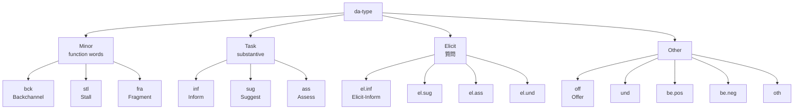

# ラベル生成

> **Status**: draft | **Last reviewed**: 2026-05-09
>
> AMI Corpus の dialog act アノテーションから、ITM のマルチイベント（turn-shift / backchannel / overlap）ラベルを自動生成する方針。

## TL;DR

- AMI 注釈の `bck` (Backchannel) → そのまま **Backchannel** ラベル
- AMI `segments/` の異話者重なり → **Overlap** ラベル
- 持続的な task/elicit 系 dialog act → **Turn-shift** ラベル
- すべて XML から自動抽出可能、手動アノテーション不要

## AMI 注釈の構造

`docs/research/datasets.md` 参照。重要なディレクトリ:

```
unpacked/
├── dialogueActs/         # 16種の対話行為タグ + 隣接ペア
├── segments/             # IPU/発話単位の時間境界
├── words/                # 単語レベル時間整合
├── disfluency/           # 言いよどみ
└── ontologies/da-types.xml  # dialog act 階層定義
```

## AMI Dialog Act 分類

`ontologies/da-types.xml` から抽出:



## ITM イベント定義（保守的に）

### Backchannel

- AMI dialog act = `bck` のセグメント
- 短い（~< 1.5 秒）
- 他話者の発話継続中に発生
- 例: "uh-huh", "yeah", "right"

```python
def is_backchannel(da_type: str, duration: float, partner_speaking: bool) -> bool:
    return da_type == "bck" and duration < 1.5 and partner_speaking
```

### Turn-shift

- 直前まで話者 A が発話
- 200ms 以上の沈黙の後、話者 B が **持続的** な発話開始
- 話者 B の最初の dialog act が `inf` / `sug` / `ass` / `el.*` / `off` のいずれか
- 話者 B の発話継続時間が 1.5 秒以上

```python
def is_turn_shift(prev_speaker: str, curr_speaker: str,
                  silence_gap: float, curr_duration: float, curr_da: str) -> bool:
    return (prev_speaker != curr_speaker and
            silence_gap >= 0.2 and
            curr_duration >= 1.5 and
            curr_da in {"inf", "sug", "ass", "el.inf", "el.sug",
                        "el.ass", "el.und", "off"})
```

### Overlap

- 話者 A の発話継続中に話者 B が発話開始
- B の発話が backchannel ではない（持続性あり）

```python
def is_overlap(a_seg, b_seg) -> bool:
    return (b_seg.start_time < a_seg.end_time and
            b_seg.start_time > a_seg.start_time and
            b_seg.duration > 0.5)  # 短いものは backchannel と区別しない
```

### Hold（負例）

上記いずれでもない時刻。明示的なラベルは不要、サバイバルハザードでは「イベント未発生」として扱う。

## 実装計画

### XMLパーサ

NXT 形式 (Standoff XML) を扱う:

```python
# 擬似コード
@dataclass
class Segment:
    start_time: float  # words.xml から解決
    end_time: float
    speaker: str       # "A" / "B" / "C" / "D"
    da_type: str       # "bck" / "inf" / etc.
    words: list[str]

def parse_meeting(meeting_id: str) -> list[Segment]:
    words_by_speaker = parse_words(meeting_id)         # 単語タイミング
    segs_by_speaker = parse_segments(meeting_id)       # 発話単位境界
    das_by_speaker = parse_dialogue_acts(meeting_id)   # dialog act タグ
    # words ID 範囲から時間を解決して結合
    ...
```

NXT 形式は `nite:child` で他ファイルを参照するスタンドオフ XML。`href="ES2002a.A.words.xml#id(ES2002a.A.words0)..id(ES2002a.A.words12)"` のような表現を解決する必要がある。

### イベント時系列の生成

```python
def generate_event_timeline(segments: list[Segment], frame_rate: int = 50):
    # 各 frame について、イベント発生時刻からの距離を記録
    timeline = {
        "turn_shift_onsets": [],   # 各 turn-shift イベントの開始時刻
        "backchannel_onsets": [],
        "overlap_onsets": [],
    }
    # ... segments を走査して onset 時刻を抽出
    return timeline
```

### サバイバル形式への変換

各 frame $t$、各 horizon $k$ について:

```python
def survival_target(timeline, t: float, K: int = 40, dt: float = 0.05):
    # 各イベントの最も近い未来 onset を探す
    targets = {}
    for event_name, onsets in timeline.items():
        future_onsets = [o for o in onsets if t < o <= t + K * dt]
        if future_onsets:
            time_to_event = future_onsets[0] - t
            target_bin = int(time_to_event / dt)
            targets[event_name] = target_bin
        else:
            targets[event_name] = -1  # censored (no event in window)
    return targets
```

## 検証戦略

自動生成ラベルの精度を確認するため:

1. **小規模 gold validation set** を手動で作る（500 frames）
2. 自動ラベルの precision / recall を測定
3. ablation: gold ラベルのみで学習 vs 自動ラベルで学習、性能差を見る

## ユニットテスト方針

```python
def test_backchannel_detection():
    # bck dialog act + 短い + 他話者発話中 → Backchannel
    ...

def test_turn_shift_detection():
    # 200ms 沈黙後の持続的 inf → Turn-shift
    ...

def test_overlap_detection():
    # A の発話中に B が割り込み → Overlap
    ...
```

## 関連ページ

- [v1 アーキテクチャ](architecture.md) — モデルの全体像
- [マルチイベント・ハザード](multi-event-hazard.md) — ラベルが入る出力の形
- [AMI Corpus 詳細](../implementation/ami-corpus.md) — XML 構造の実物
- [データ戦略](data-strategy.md) — Smart Turn データとの組み合わせ
