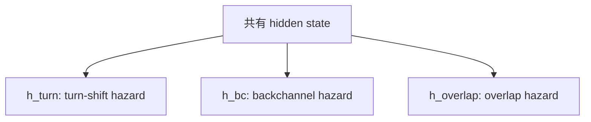

# マルチイベント・サバイバルハザード

> **Status**: draft | **Last reviewed**: 2026-05-09
>
> ITM の出力定式化。**なぜ二値分類でなくハザード関数か**、**なぜ単一でなくマルチイベントか** を整理。

## TL;DR

- **二値分類** ではなく **離散時間サバイバルハザード**: 任意のしきい値で動作点を変えられ、校正性が良い
- **単一出力** ではなく **マルチイベント**（turn-shift / backchannel / overlap）: 下流アプリが必要なものだけ使える
- 研究的にも実用的にも、これが最適と判断

## 出力の定式化

時刻 $t$ で、各イベント $e \in \{\text{turn-shift}, \text{backchannel}, \text{overlap}\}$ について **離散時間ハザード関数** を出力:

$$
h_e(t, k) = P\bigl(\text{event } e \text{ occurs in } [t + k\Delta,\ t + (k+1)\Delta) \mid \text{not yet, } x_{\le t}\bigr)
$$

- $\Delta = 50\,\text{ms}$
- $k \in \{0, 1, \ldots, K-1\}$, $K = 40$（2 秒先まで）

サバイバル関数は

$$
S_e(t, k) = \prod_{j=0}^{k-1} (1 - h_e(t, j))
$$

で導出される。pre-onset 検出は $S_e(t, k) < \theta$ となる最小 $k$ で実装でき、運用時の動作点がしきい値スライドのみで動く。

## なぜハザード形式か

### 二値分類の問題点

「相手が話そうとしているか」を二値で出すと:

- **動作点が固定**: 学習時に決めた閾値以外で運用するには再学習が必要
- **校正崩壊**: 二値 cross-entropy は出力確率の校正性を保証しない
- **時間情報の損失**: 「いつ」が分からない

### サバイバルハザードの利点

- **時間軸全体を表現**: 50ms から 2 秒まで連続的に予測
- **しきい値スライドで動作点変更**: 再学習不要
- **校正性**: NLL ベースなので確率の意味が保たれる
- **打ち切り対応**: イベントがウィンドウ外でも自然にモデル化可能

### 既存研究との関係

- **VAP**: 未来 2 秒の発話活動分布を 8 bin で予測 → 我々はこれを 40 bin に細粒化、かつイベント別に分離
- **DualTurn**: 6 分類 (per channel)、220ms 早期予測を主張 → 我々は連続ハザードで lead time を任意に取得
- **Easy Turn**: 4 状態分類（complete / incomplete / backchannel / wait）→ 我々は連続化

## なぜマルチイベントか

### 単一出力の致命的問題

「相手が話そうとしているか」を1つの確率で出すと、「うん」のたびに発火する。これは対話システムでは致命的:

- Backchannel に対しては自分の発話を継続すべき
- Turn-shift に対しては自分の発話を止めるべき
- これを同じ確率で出すと判断不能

### マルチイベント設計

3 つの独立 sigmoid head:



下流アプリは必要なものだけ使う:

- **対話システムのエンドポイント検出** → `h_turn`
- **共感的な相槌生成** → `h_bc`
- **割り込み制御** → `h_overlap`

### 視覚シグナルとの相性

イベント種別を区別するには、**視覚的準備の "深さ"** が手がかりになる:

| 視覚的準備 | Turn-Shift | Backchannel | Overlap |
|---|---|---|---|
| 吸気の深さ | **深い** | 浅い | 浅く急 |
| 姿勢の変化 | 前傾 | ほぼなし | なし |
| 口の開き持続 | 持続的 | 一瞬 | 急 |
| 視線復帰 | あり長め | 短め | 不規則 |

VAP / MM-VAP は音声中心で、これら視覚的「深さ」を捉えにくい。我々の差別化点。

## 損失関数

### 主損失（discrete-time survival NLL）

各イベント $e$、観測された次 onset までの残り bin を $k_e^*$ とすると:

$$
L^e_{\text{survival}}(t) = -\log h_e(t, k_e^*) - \sum_{j=0}^{k_e^*-1} \log(1 - h_e(t, j))
$$

打ち切り（onset がウィンドウ外）には自然対応。

### 補助損失

```
L_total = Σ_e L_survival_e
        + λ_VAD · L_VAD                    # 自分・相手の VAD 補助
        + λ_filler · L_filler              # midfiller / endfiller (Smart Turn データ流用)
        + λ_calib · L_calibration_ECE      # 校正性
        + λ_disambig · L_event_disambig    # イベント間の排他性
        + λ_modal · L_modality_consist     # モダリティドロップアウト一貫性
```

### イベント区別損失（提案）

混乱しやすい時刻 $t$ で正しいイベント種別だけが高くなるよう促す:

$$
L_{\text{disambig}}(t) = -\log \frac{\exp s_{e^*}(t)}{\sum_e \exp s_e(t)}
$$

ここで $s_e(t)$ は onset 時刻周辺での平均ロジット、$e^*$ が正解イベント。

これにより「Turn-Shift と Backchannel の両方を高く出す」事態を抑制できる。

### 反事実的時間整合損失（v2 で追加検討）

視覚モダリティが音声 prosody のショートカットに依存しないよう、音声を ±100〜400ms シフトしてもハザードが整合するように制約:

$$
L_{\text{cf-time}} = \mathbb{E}_{\delta \in [-400, 400] \text{ms}} \bigl[\, \text{KL}(h(\cdot \mid x) \,\|\, h(\cdot \mid x_{\text{shift}(\delta)})) \,\bigr]
$$

## 評価指標

ハザード形式に整合した指標:

| 指標 | 計算方法 |
|---|---|
| **Hazard AUC** | 各 horizon $k$ での AUROC |
| **Average Precision (AP)** | クラス不均衡に強い |
| **Recall @ FPR=5%** | 誤起動率 5% での検出率 |
| **Mean anticipation time** | 正検出時の平均先取り ms |
| **Brier Score** | 確率予測の質 |
| **ECE** | 期待校正誤差 |
| **False start rate** | 700ms 以上前から高確率を出す誤検出率 |
| **Backchannel-Turn confusion** | 混同行列 |

## 関連ページ

- [v1 アーキテクチャ](architecture.md) — モデル全体の中での位置
- [ラベル生成](label-generation.md) — AMI から各イベントラベルを作る方法
- [新規性](novelty.md) — ハザード形式・マルチイベントの新規性
