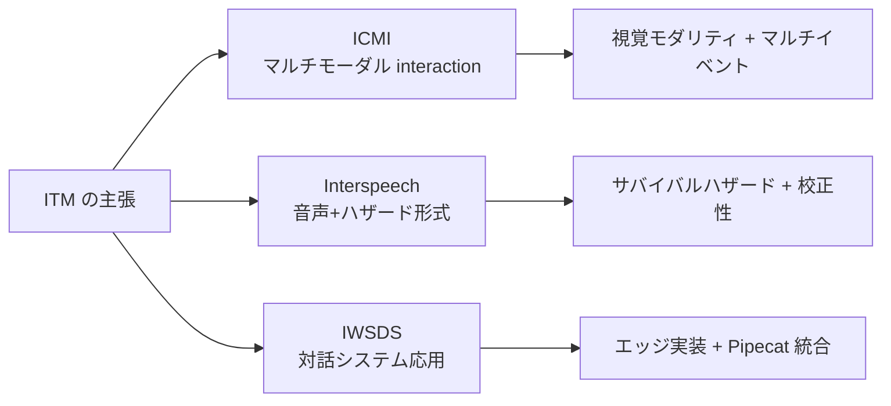

# 新規性

> **Status**: draft | **Last reviewed**: 2026-05-09
>
> 既存研究との差別化。査読対策のためにも、何が新しいかを明示する。

## TL;DR

主要な新規性は4つ:

1. **マルチイベント・サバイバルハザード**（turn-shift / backchannel / overlap を統一的に予測）
2. **エッジ実装可能な視覚統合**（MediaPipe + 軽量融合、< 15M params）
3. **顔のみからの呼吸抽出**（v2、rPPG 等の派生信号）
4. **多モーダル統合のオープンソース・エッジ実装**（Smart Turn / MaAI と並ぶ立ち位置）

## 既存研究との差別化マトリクス

| 軸 | VAP | MM-VAP | Smart Turn v3 | MaAI | DualTurn | Obi & Funakoshi | **ITM v1** |
|---|---|---|---|---|---|---|---|
| 出力タイプ | 二値 | 二値 | 二値 | 二値 | 二値 | 二値 (200ms 先) | **マルチイベント連続ハザード** |
| イベント区別 | × | × | × | △ (BC 別モデル) | △ (6 cls) | × | **○ (3 イベント独立)** |
| モダリティ | 音声 | 音声+映像 | 音声 | 音声 | 音声 | 顔→呼吸 | **音声+顔特徴** |
| 呼吸統合 | × | × | × | × | × | ○ (3DCNN) | **○ (v2 で rPPG)** |
| エッジ実装 | △ | × | ○ (8M, BSD) | ○ (academic) | × | × | **○ (BSD 同等)** |
| ライセンス | research | research | **BSD** | code MIT, weights academic | research | unspec | **BSD** |
| 言語 | 英 | 英 | 23 言語 | 多言語 | 多言語 | 日 | 英 (v1) |
| ベース実装 | 自前 | 自前 | 自前 | 自前 | 自前 | 自前 | **MaAI 上に構築** |

## 主張すべき貢献の言語化

論文・README・モデルカードで使えるフレーズ:

> 既存のターンテイキング予測モデル（VAP / Smart Turn / MM-VAP / DualTurn）は、出力を単一の二値判定に統合しており、turn-shift と backchannel を区別できない。本研究はこれを **multi-event survival hazard** として統一的に拡張し、エッジデバイスで動作する軽量実装をオープンソース・寛容ライセンス（BSD 2-Clause）で公開する。さらに、**顔のみからの呼吸シグナル抽出** を視覚モダリティに統合する設計を v2 として提案する。

## 個別の主張と根拠

### 主張 1: マルチイベント・サバイバルハザード

**根拠**:

- VAP / MM-VAP は単一二値出力で、turn-shift と backchannel が混ざる
- Easy Turn は 4 状態分類だが離散
- DualTurn は 6 分類だが per-channel で event-type を区別しない
- Inoue et al. (NAACL 2025) はバックチャネル予測を VAP の **別モデル** として実装、統合的なフレームワークではない
- 我々は **連続ハザード形式で 3 イベント同時予測** を一つのモデルで実現

**反論への備え**:

- Q: なぜ 3 つだけ？ A: 主要な区別は turn-shift / backchannel / overlap で十分。fine-grained な dialog act 分類は v2 の future work
- Q: ハザード形式は連続値でラベルが要求される A: AMI dialog act から自動生成（[ラベル生成](label-generation.md)）

### 主張 2: エッジ実装可能な視覚統合

**根拠**:

- MM-VAP / MM-F2F は研究室実装でサイズ・依存が重い
- Smart Turn v3 は 8M / int8 量子化でエッジ動作するが **音声のみ**
- 我々は **MediaPipe + 軽量 MLP + 後期融合** で < 15M params に収める
- ONNX export + int8 QAT で CPU リアルタイム

**反論への備え**:

- Q: 視覚追加で精度は上がるか A: MM-VAP の知見（79% → 84%）からエビデンスあり、AMI で再現する
- Q: MediaPipe はエッジで遅い A: CPU 5ms/frame、30Hz 動作実証済み

### 主張 3: 顔のみからの呼吸抽出（v2）

**根拠**:

- Obi & Funakoshi (ICMI 2023) は **接触型ベルト** または **3DCNN 直接回帰** で呼吸を取る
- 我々は **rPPG / 鼻孔フレア / 頭部 micro-motion** の派生信号を late fusion
- これにより上半身が映らない（クローズアップ・ビデオ会議）シナリオで動く

**反論への備え**:

- Q: rPPG は本当に呼吸取れるか A: RIIV (Respiratory-Induced Intensity Variation) の文献あり、PhysMamba 等で実証済み
- Q: 暗肌で精度劣化 A: PhysFlow (BMVC 2024) の skin-tone augmentation で対処
- Q: マスク・ヒゲで使えない A: 3 経路 late fusion で冗長化

### 主張 4: オープンソース・エッジ実装

**根拠**:

- Smart Turn v3 / TurnSense / VAP-Realtime 等の OSS landscape にマルチモーダル+マルチイベント版が存在しない
- BSD 2-Clause で **Pipecat エコシステム互換**（ONNX I/O 形状を Smart Turn と揃える）
- HuggingFace に `pipecat-ai/smart-turn-v*` と並べて公開可能

**反論への備え**:

- Q: 既存の Pipecat とどう統合するか A: Smart Turn v3 の `LocalSmartTurnAnalyzerV3` 互換 API を提供、drop-in compat mode + 拡張モード
- Q: ライセンス問題 A: コードは BSD 自前、データは AMI (CC BY) と Smart Turn (BSD)、再配布可

## ICMI / Interspeech / IWSDS への投稿戦略

トップライン主張で投稿先を変える。最有力は **ICMI**（マルチモーダル + 視覚 + 対話 interaction が揃う）。

## 過去の主張（破棄・修正）

参考までに、Obi & Funakoshi 2023 / IWSDS 2025 を踏まえて修正した主張:

- ~~「世界初の視覚→呼吸→ターンテイキング統合」~~ → Obi & Funakoshi (ICMI 2023) が先行
- ~~「単一二値ではなくハザードに移行する初の研究」~~ → DualTurn が 6 分類で先行（ただし event 区別なし）
- ~~「マルチイベント分類の初の研究」~~ → Easy Turn が 4 状態で先行（ただし離散）

修正後の主張は **「これらの先行を統合し、エッジで動く形でオープンソース化する」** という統合・実装上の貢献。

## 関連ページ

- [v1 アーキテクチャ](architecture.md) — どう実装するか
- [マルチイベント・ハザード](multi-event-hazard.md) — 主張 1 の詳細
- [既存モデル](../research/existing-models.md) — 比較対象の詳細
- [関連研究](../research/related-work.md) — 特に Obi & Funakoshi シリーズ
