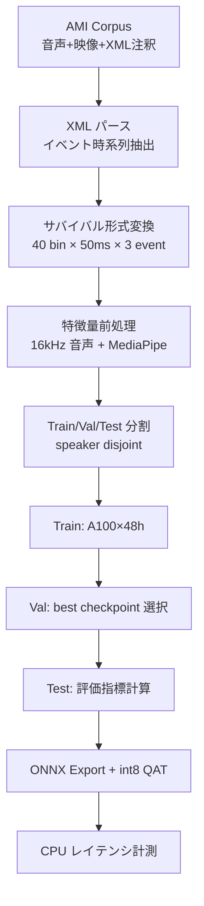

# 学習パイプライン

> **Status**: draft | **Last reviewed**: 2026-05-09
>
> Phase 2 以降の学習・評価パイプライン詳細。執筆中。

## 状態

このページは Phase 2 着手後に充実させる。現時点では設計の枠組みのみ。

## 想定パイプライン



## データ分割方針

### Speaker-disjoint split

- AMI は同じ話者が複数会議に登場することがある
- Train / Val / Test で話者を共有しないように分割
- Val は約 10%、Test は約 15% 目安

### 短期的なベンチマークセット

Phase 2 までは 5 ミーティング（~3GB）で速く回せるベンチを作り、Phase 3-4 で全 168 ミーティングへ拡張。

## 学習スケジュール（A100×48h 内訳）

| 段階 | 想定時間 |
|---|---|
| データ前処理（MediaPipe 抽出含む） | 4-6h（CPU で並列） |
| Phase 2 Hazard heads 学習 | 12h |
| Phase 3 視覚 fusion 学習 | 12h |
| Phase 4 量子化 + 評価 | 6h |
| Ablation 諸々 | 6-12h |

**合計 48h** に収めるためには:

- CPC エンコーダはフリーズ
- バッチサイズは GPU メモリで決まる（A100 で 16-32 想定）
- データローディングを CPU 並列で完璧にしておく

## 評価コード

詳細実装は Phase 2 で固める。骨組み:

```python
from itm.metrics import (
    HazardAUC,
    LeadTimeAtFPR,
    EventConfusion,
    BrierScore,
    ECE,
)

metrics = {
    "auc_turn":     HazardAUC(event="turn-shift"),
    "auc_bc":       HazardAUC(event="backchannel"),
    "auc_overlap":  HazardAUC(event="overlap"),
    "leadtime_5%":  LeadTimeAtFPR(fpr=0.05),
    "confusion":    EventConfusion(),
    "brier":        BrierScore(),
    "ece":          ECE(n_bins=10),
}

for batch in test_loader:
    pred = model(batch)
    for name, m in metrics.items():
        m.update(pred, batch.targets)

results = {name: m.compute() for name, m in metrics.items()}
```

## 関連ページ

- [v1 アーキテクチャ](../design/architecture.md) — モデル定義
- [マルチイベント・ハザード](../design/multi-event-hazard.md) — 損失と評価
- [ラベル生成](../design/label-generation.md) — データ前処理
- [ロードマップ](../about/roadmap.md) — Phase 別計画
