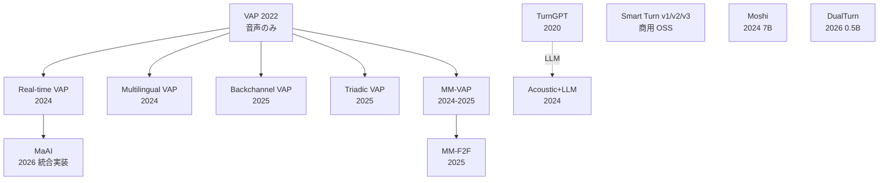

# 既存モデル

> **Status**: stable | **Last reviewed**: 2026-05-16
>
> ターンテイキング予測モデルの主要先行研究まとめ。

## ITM はどこに立つのか（先に読む）

このページは個別モデルを詳しく扱うが、まず ITM がそれらとどう違うかを 1 表で:

| 軸 | 既存の代表 | ITM v1 |
|---|---|---|
| 出力 | 二値「次に喋るか」（VAP / Smart Turn / MaAI / DualTurn） | **3 イベント連続ハザード** (turn-shift / backchannel / overlap) |
| モダリティ | 音声のみが主流（MM-VAP のみ視覚） | **音声 + 顔特徴**（v2 で呼吸プロキシ） |
| サイズ | サーバ級が主流（Moshi 7B、DualTurn 0.5B） | **< 10M params**、CPU リアルタイム |
| ベース実装 | 各々スクラッチ | **MaAI を backbone**、heads と shift_head を独立追加 |
| ライセンス | research が多い（Smart Turn のみ BSD） | **BSD 2-Clause** |

詳細は [新規性](../design/novelty.md) の差別化マトリクス。本ページは各モデルの中身を順に追う。

## 概観

### 派生関係

## VAP 系列（音声）

### VAP (Ekstedt & Skantze, Interspeech 2022)

- **入力**: ステレオ音声、16kHz、最大 20 秒
- **アーキテクチャ**: CPC (5層 CNN + GRU) + Self-Attention + Cross-Attention Transformer
- **出力**: 次 2 秒の発話活動分布（256 状態）
- **学習**: 自己教師あり（VAD ラベルから自動生成）
- **データ**: Switchboard, Fisher
- **重要数値**: ホールド/シフト精度 79%（後の MM-VAP の比較対象）

### Real-time VAP (Inoue et al., IWSDS 2024)

- arXiv:2401.04868
- VAP のリアルタイム実装。TCP ストリーミング、CPU 動作
- 160 sample (10ms@16kHz) 単位処理

### Multilingual VAP (Inoue et al., LREC-COLING 2024)

- arXiv:2403.06487
- 英・中・日の三言語対応
- Wav2Vec2 (MMS) をエンコーダに使用

### Backchannel VAP (Inoue et al., NAACL 2025)

- arXiv:2410.15929
- VAP をバックチャネル予測にファインチューニング
- 「Yeah」「Un」「Oh」種別予測

### Triadic VAP (Elmers et al., Interspeech 2025)

- arXiv:2507.07518
- VAP を初めて三者会話に拡張
- 新規日本語三者コーパス TEIDAN を構築

### MaAI (旧 VAP-Realtime, 2026)

- 京大・井上研の現役メンテ実装
- `pip install maai` で即動作
- HuggingFace `maai-kyoto/*` に **29 モデル**
- VAP / VAP_BC / VAP_Nod / VAP_MC (ノイズ耐性) / VAP_Prompt
- 言語: 英・日・中・仏・trilingual
- ライセンス: コード MIT、重みは academic only
- **ITM の v1 ベースライン**

## マルチモーダル VAP

### MM-VAP (Inoue et al., IEICE 2024 / arXiv:2506.03980)

- 音声 + 視覚特徴（FAU、視線、頭部姿勢）の **後期融合**
- ホールド/シフト精度: 79% → **84%**（音声のみと比較）
- アクションユニット（顔筋肉動き）が最大の貢献
- オーバーラップ予測が特に改善
- ※ 略称 "MM-VAP" は本文中の表現でアブストでは未確認、引用注意

### MM-F2F (arXiv:2505.12654, ACL 2025 Findings)

- GPT-2 + HuBERT + VideoMAE の3モーダル融合
- 独自 210h データセット
- ターンテイキング F1 = 0.81、バックチャネル F1 = 0.349

### Voice Activity Projection Model with Multimodal Encoders (arXiv:2506.03980)

- VAP に Former-DFER（顔エンコーダ）と身体姿勢を統合
- 実装: github.com/sagatake/VAPwithAudioFaceEncoders

## テキスト・LLM 系列

### TurnGPT (Ekstedt & Skantze, EMNLP 2020 Findings)

- arXiv:2010.10874
- GPT-2 ベースの Transformer
- テキスト（転記）から Turn Relevant Point (TRP) を予測
- 「tomorrow」と「yesterday」で予測確率が変わることを実証
- 重み非公開、保守停止（3 年半）

### Acoustic + LLM Fusion (Wang et al., ICASSP 2024)

- arXiv:2401.14717
- Amazon Alexa
- 音響モデル + GPT-2 (124M) / RedPajama (3B) のフュージョン
- Switchboard で F1 (weighted) 0.633

### Easy Turn (arXiv:2509.23938)

- 音響 + 言語 2モーダル
- 4 状態予測: complete / incomplete / backchannel / wait
- 学習データ 1,145h
- HuggingFace 公開: `ASLP-lab/Easy-Turn`

## フルデュプレックス基盤モデル

### Moshi (Kyutai, arXiv:2410.00037)

- 7B 音声テキスト基盤モデル
- ユーザー音声と自分の音声を **並列ストリーム** 化
- 理論遅延 160ms、実測 ~200ms (L4 GPU)
- アーキテクチャ: Helium (7B) + Mimi コーデック + Temporal Transformer + Depth Transformer
- OSS: github.com/kyutai-labs/moshi

### DualTurn (arXiv:2603.08216, 2026)

- Mimi コーデック (フリーズ) + 0.5B LLM
- 各話者チャンネル 6 分類予測
- VAP より **220ms 早く** ターン終了予測
- アノテーション不要

## エッジ系列

### Smart Turn v3 (pipecat-ai)

- **8M params**、Whisper Tiny encoder + attention pooling + 軽量分類ヘッド
- int8 static QAT、CPU 12ms
- BSD 2-Clause（最も寛容）
- HuggingFace: `pipecat-ai/smart-turn-v3`
- データ: `pipecat-ai/smart-turn-data-v3.1-train` (270k 件、23 言語)
- **限界**: 単一二値出力、視覚なし、`midfiller` / `endfiller` ラベルが未活用

### TurnSense (latishab)

- SmolLM2-135M ファインチューニング
- Raspberry Pi 対応の超軽量モデル

### SpeculativeETD (arXiv:2503.23439, 2025)

- 軽量 GRU (ローカル) + 重い Wav2Vec (サーバー) の二段投機的推論
- レイテンシと精度のトレードオフ管理

## ITM ポジショニング

我々が乗っかるベース実装と、超えるべき先行:

| 項目 | ベース | 超える対象 |
|---|---|---|
| 実装フレームワーク | **MaAI** | — |
| アーキテクチャ参考 | **Smart Turn v3** | 単一二値 → マルチイベント |
| 視覚統合の参考 | MM-VAP | 英語のみ → 我々は AMI で再現 + 拡張 |
| 軽量化技法 | Smart Turn v3 (int8 QAT) | — |
| マルチイベント | Easy Turn (4状態分類) | 連続ハザード形式に |

詳細は [v1 アーキテクチャ](../design/architecture.md)。

## 関連ページ

- [ターンテイキング 101](turn-taking-101.md) — 用語と問題設定
- [視覚シグナル](visual-cues.md) — マルチモーダル化の手段
- [v1 アーキテクチャ](../design/architecture.md) — ITM の設計
- [新規性](../design/novelty.md) — 既存研究との差別化
