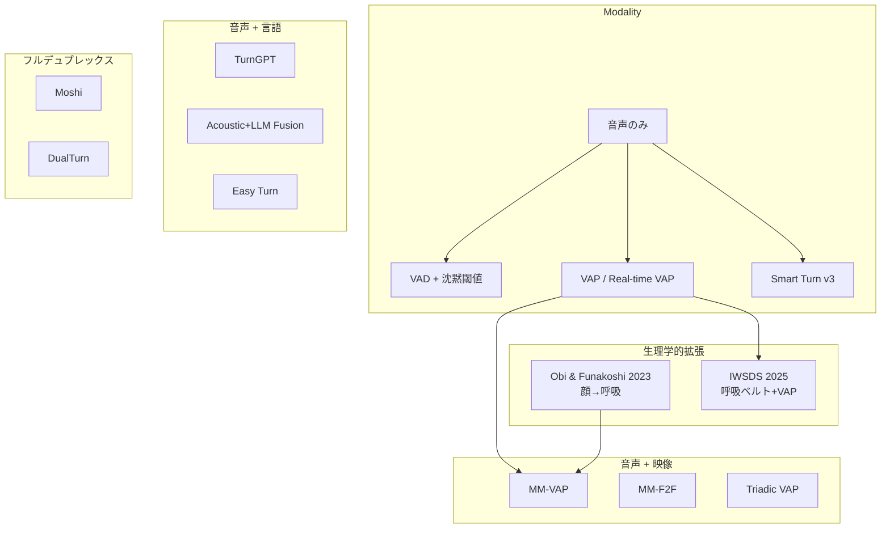
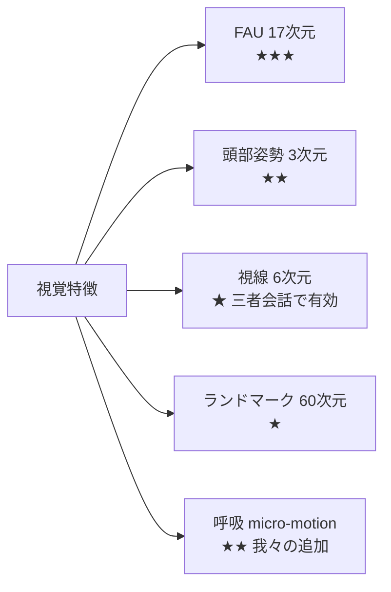

# 調査の概観

> **Status**: stable | **Last reviewed**: 2026-05-09
>
> ターンテイキング AI 研究領域の全体像。詳細は配下の各ページへ。

## 研究領域の地図

## 歴史的経緯（2015〜2026）

| 期 | 代表的研究 | 特徴 |
|---|---|---|
| ~2015 | VAD + 固定沈黙閾値 | 700〜1000ms 待機、不自然 |
| 2015〜2019 | Skantze 2017、Roddy 2018 | LSTM 連続予測 |
| 2020〜2021 | TurnGPT (Ekstedt 2020) | GPT-2 ベースのテキスト予測 |
| 2022〜現在 | **VAP (Ekstedt & Skantze 2022)** | 自己教師あり、CPC + Transformer |
| 2024〜現在 | Moshi、DualTurn、MM-VAP | フルデュプレックス、マルチモーダル |

## 主要モデル比較表

| モデル | モダリティ | パラメータ | エッジ | ライセンス | 備考 |
|---|---|---|---|---|---|
| VAP (2022) | 音声 | ~10M | ✅ | academic | 自己教師あり、現在の標準 |
| Real-time VAP / **MaAI** | 音声 | ~10M | ✅ | code MIT, weights academic | Mimi/CPC 両対応、29 モデル公開 |
| TurnGPT (2020) | テキスト | 124M+ | ✅ | — | 重み非公開、3年半放置 |
| MM-VAP (2024) | 音声+映像 | ~30M | ❌ | research | FAU・視線・頭部 |
| Moshi (2024) | 音声 (フルデュプレックス) | 7B | ❌ | apache | 200ms 遅延 |
| DualTurn (2026) | 音声 (双チャンネル生成) | 0.5B | ❌ | — | 220ms 早期予測 |
| Smart Turn v3 | 音声 | **8M** | ✅ | **BSD-2** | int8 量子化、CPU 12ms |
| Easy Turn (2025) | 音声+言語 | — | ⚠️ | — | 4 状態分類 |

詳細は [既存モデル](existing-models.md)。

## データセット概観

| データセット | 規模 | 言語 | 個人入手 | ターンテイキング適合度 |
|---|---|---|---|---|
| **AMI Corpus** | 100h、4人会議 | 英 | ✅ CC BY 4.0 | ★★★ |
| Switchboard | 260h、電話 | 英 | ❌ LDC 有料 | ★★★ |
| Fisher | 2000h | 英 | ❌ LDC | ★★★ |
| **CANDOR** | 850h、ビデオ会議 | 英 | ⚠️ 個人申請可能性 | ★★★ |
| **Multi-TPC (2025)** | 三者対話 | 英 | ✅ Zenodo | ★★ |
| Smart Turn v3.1 train | 270k samples | 23 言語 | ✅ HF, BSD | ★（endpoint+filler のみ） |
| NoXi+J | 11.6h、二者 | 多言語 | ❌ アカデミック EULA | — |
| CEJC | 200h | 日 | ❌ 有料 | — |
| Hazumi | 181人 | 日 | ❌ NII IDR | — |

詳細は [データセット](datasets.md)。

## 視覚シグナルの寄与度（MM-VAP 研究より）

詳細は [視覚シグナル](visual-cues.md)。

## 主要参照論文

実在確認済みのものは [論文リスト](../reference/papers.md) を参照。直近で重要なもの:

- VAP (arXiv:2205.09812)
- MM-VAP (arXiv:2506.03980)
- DualTurn (arXiv:2603.08216)
- Moshi (arXiv:2410.00037)
- Coupled Mamba (arXiv:2405.18014)
- V-JEPA 2 (arXiv:2506.09985)
- V-JEPA 2.1 (arXiv:2603.14482)
- Obi & Funakoshi 2023 (doi:10.1145/3577190.3614154)
- Włodarczak & Heldner 2016 (Interspeech)

## 関連ページ

- [ターンテイキング 101](turn-taking-101.md) — 用語と問題設定の入門
- [既存モデル](existing-models.md) — 各モデルの詳細
- [視覚シグナル](visual-cues.md) — 顔・呼吸・姿勢の活用
- [データセット](datasets.md) — 入手可能性と適合度
- [関連研究](related-work.md) — 我々の直接の先行（特に Obi & Funakoshi）
