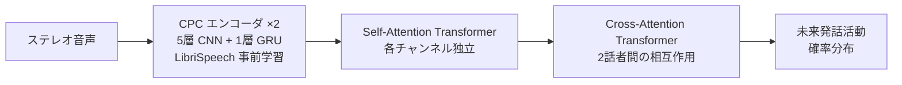

# ターンテイキング 101

> **Status**: stable | **Last reviewed**: 2026-05-09
>
> ターンテイキング研究の基礎概念。専門用語に詳しくない読者向けの入門。

## ターンテイキングとは

会話で「誰がいつ話すか」を決めているメカニズム。Sacks, Schegloff & Jefferson (1974) の古典研究以来、会話分析の中核概念。

人間の会話では話者交代が **約 200ms ギャップ** で起きる (Stivers et al. 2009)。これは音声認識結果が出てから判断していたら間に合わない時間軸であり、人間は相手の **発声前** の手がかりから次の話者を推定している。

## 検出すべきイベントの種類

| イベント | 説明 | 我々の関心度 |
|---|---|---|
| **ターンシフト**（Turn Shift） | 話者が交代する（A→B） | ★★★ |
| **ターンホールド**（Hold） | 現在の話者が継続 | ★（ベースライン） |
| **バックチャネル**（Backchannel） | 「うん」「なるほど」など、発話権は移譲されない | ★★★ |
| **ターンイールディングキュー** | 話者が発話権を手放す意図を示す手がかり | ★★ |
| **ターンテイキングキュー** | 聞き手が発話権を取ろうとする手がかり | ★★ |
| **オーバーラップ** | 二者以上が同時に発話 | ★★ |
| **バージイン** | システム発話中にユーザーが割り込む | ★ |

!!! info "なぜバックチャネルを区別する必要があるか"
    対話システムでは「うん」と「私の考えでは」では **応答すべき動作が真逆**。前者は無視、後者は発話を止めて聞く。単一二値出力ではこれを区別できない。

## 二者会話 vs 多者会話

| 項目 | 二者 (Dyadic) | 多者 (Multiparty) |
|---|---|---|
| 発話権の所在 | 一方に存在 or オーバーラップ | 複雑（誰が次に話すかが追加問題） |
| アドレシー判定 | 不要 | 必要（誰に向けて話しているか） |
| 視線の重要度 | 限定的 | 非常に有効 |
| 研究の蓄積 | 豊富 | 少ない（Triadic VAP 2025 が初） |

ITM v1 は **二者会話** に絞る。多者は将来課題。

## オフライン検出 vs リアルタイム予測

| 項目 | オフライン | リアルタイム |
|---|---|---|
| 入力 | 会話全体（事後） | ストリーミング音声 |
| 遅延許容 | 大 | 目標 < 300ms |
| 活用場面 | 会話分析、コーパス構築 | 対話システム、ロボット |
| 典型モデル | BERT, GPT 系 | VAP, CPC + Transformer |

ITM は **リアルタイム** が前提。

## VAP（Voice Activity Projection）の仕組み

現在のターンテイキング研究の **最重要ベースライン**。Ekstedt & Skantze 2022 で提案された自己教師あり学習。

### 入出力

- **入力**: ステレオ音声（各チャンネルが各話者の音声）、16kHz、最大 20 秒
- **出力**: **次の 2 秒間の両話者の発話活動分布**を確率として出力

### アーキテクチャ

### なぜ自己教師ありか

VAP のターゲット（未来 2 秒の発話活動）は **音声 VAD だけで自動生成** できるので、ターンシフト・バックチャネル等の手動ラベリングが不要。これにより数千時間規模のデータで事前学習できる。

### 限界

- 単一の出力（発話活動の分布）→ ターンシフトとバックチャネルを区別しない
- 音声のみ → 視覚手がかりを使えない
- アカデミック license（MaAI 配布の重み）

ITM はこれらを克服することを目指す。

## 主要な評価指標

| 指標 | 内容 |
|---|---|
| **F1 / AUC** | 各イベントの分類精度 |
| **Lead Time** | 正解時刻に対してどれだけ先取りで予測できたか (ms) |
| **Onset Offset** | 応答開始タイミング - 正解開始タイミング |
| **Brier Score / ECE** | 確率の校正性 |
| **Inference Latency** | リアルタイム動作可否 |

## 関連ページ

- [既存モデル](existing-models.md) — VAP の派生・後継モデル
- [視覚シグナル](visual-cues.md) — 視覚モダリティの活用
- [マルチイベント・ハザード](../design/multi-event-hazard.md) — ITM の出力定式化
- [用語集](../reference/glossary.md) — 個別用語の定義
