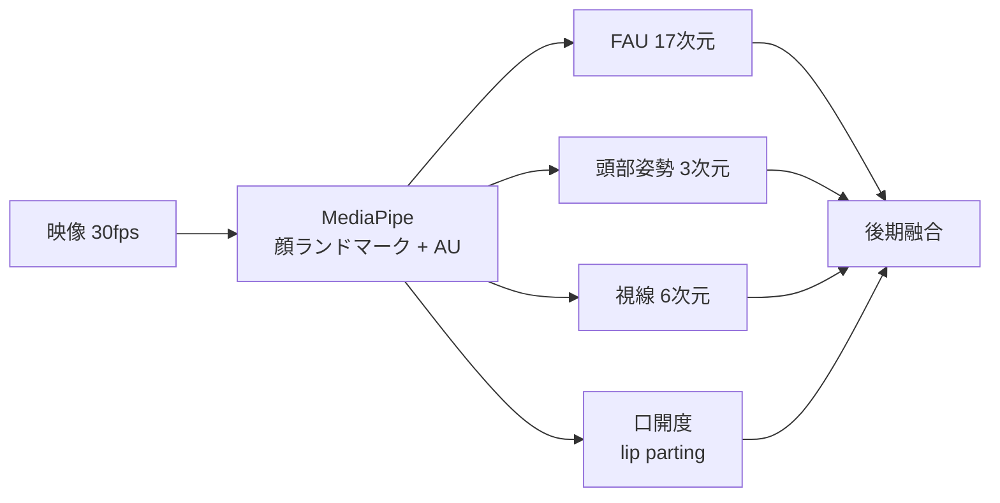

# 視覚シグナル

> **Status**: stable | **Last reviewed**: 2026-05-09
>
> ターンテイキング予測に有用な視覚的手がかり。特に「発声前」を予測する上で、視覚は音声に先行する情報を持つ。

## TL;DR

- **顔の動作単位 (FAU)** が最も寄与する（MM-VAP 研究）
- **頭部姿勢** が次点
- **視線** は二者会話では限定的、三者以上で有効
- **呼吸** は発声 200ms 前にピークが立つ（Włodarczak 2016, Sci Rep 2025）
- 我々の追加: 顔のみで呼吸を **rPPG / 鼻孔 / 頭部 micro-motion** から取る

## 視覚特徴の寄与度ランキング（MM-VAP 研究より）

| 順位 | 特徴 | 次元数 | ホールド/シフト精度への寄与 |
|---|---|---|---|
| 1 | **FAU**（Facial Action Units） | 17 | 最大。眉・顎・鼻・唇の筋肉動き |
| 2 | **頭部姿勢** | 3 (roll, pitch, yaw) | 大 |
| 3 | **視線** | 6 (各眼 3D) | 三者会話で有効、二者では限定的 |
| 4 | **顔ランドマーク** | 60 (15点 × 座標) | 中 |
| 5 | **身体ジェスチャー** | 可変 | NoXi 系研究で有効 |

## 顔特徴抽出の標準ツール

| ツール | 出力 | 特徴 |
|---|---|---|
| **OpenFace 2.0** | FAU、頭部姿勢、視線、ランドマーク | 標準ツール、CPU 動作 |
| **MediaPipe Face Mesh** | 468 ランドマーク + メッシュ | リアルタイム、モバイル/エッジ向き |
| **Former-DFER** | 顔表情特徴ベクトル | 動的顔表情認識 Transformer |

ITM v1 は **MediaPipe** を採用（エッジ実装と整合性）。

## 呼吸シグナル（生理学的根拠）

### Włodarczak & Heldner (Interspeech 2016)

- 「Respiratory Turn-Taking Cues」
- 全話者状態遷移（silent / speaking / backchanneling）に対して
- **吸気深度・吸気持続時間・呼吸 range** が有意な予測子
- ISCA Archive: `wodarczak16b_interspeech`

### Di Pasquasio et al. (Scientific Reports 2025)

- doi:10.1038/s41598-025-15776-1
- fMRI 自然会話を解析
- **respiratory local maxima が speech onset の ~200ms 前** に出現
- 前運動皮質・補足運動野の活動が確認
- 呼吸 200ms 先行を **脳活動レベルで裏打ち**

### Obi & Funakoshi (ICMI 2023) — 我々の最重要先行研究

- doi:10.1145/3577190.3614154
- 顔・上半身映像から呼吸波形を回帰推定 (VRWE タスク)
- 3DCNN-ConvLSTM で 256×256 RGB 10 frame stack を入力
- **呼吸波形 gradient が voice activity の 200ms 先行予測に有効**
- データセット: 30人 (subset of 80)、日本語、安静+対話、呼吸ベルト同時記録
- 後続: IWSDS 2025（呼吸ベルト + VAP 統合）、HRI 2024、SIGDIAL 2024

詳細は [関連研究](related-work.md) の Obi & Funakoshi セクション。

## 顔のみから呼吸を取る経路（5 つ）

```mermaid
graph TB
    F[顔 ROI] --> A[a) rPPG → RIIV<br/>主役]
    F --> B[b) 鼻孔フレア<br/>補助]
    F --> C[c) 頭部 micro-motion<br/>補助]
    F --> D[d) 首 sternocleidomastoid<br/>SCM が映る場合]
    F --> E[e) 口呼吸/鼻呼吸モード<br/>口開度]
```

### a) rPPG (remote photoplethysmography) — 最有力

- 呼吸性血流変動 (RIIV: Respiratory-Induced Intensity Variation) を顔の色変化から抽出
- 心拍 (0.7〜4Hz) と呼吸 (0.1〜0.5Hz) はバンドパスで分離可能
- 主要モデル:
    - **EfficientPhys** (WACV 2023): TSM ベース、エッジ向け、TFLite 化容易
    - **PhysMamba** (PRCV 2024, arXiv:2409.12031): Mamba SSM、軽量
    - MTTS-CAN (NeurIPS 2020): 150fps+、モバイル設計
    - PhysFormer (CVPR 2022): SOTA だが重い
- OSS: **rPPG-Toolbox** (NeurIPS 2023, github.com/ubicomplab/rPPG-Toolbox)
- 弱点: 暗肌で精度劣化（MAE 5.2 → 14.1 bpm）→ PhysFlow (BMVC 2024) で対処

### b) 鼻孔フレア (nostril flaring)

- 吸気時に鼻翼が拡張
- MediaPipe Face Mesh の鼻翼ランドマーク（49, 279）から距離計算
- 安静呼吸では微小（0.5〜2mm）、200px 以下では SNR 低下

### c) 頭部 micro-motion

- 呼吸リズム（〜0.3Hz）で頭が微妙に上下/前後
- 古典: Eulerian Video Magnification (Wu et al., SIGGRAPH 2012)
- Phase-Based VM (Wadhwa et al., SIGGRAPH 2013) — 微小動作向き
- 学習系: Deep Magnification (Oh et al., ECCV 2018)
- 弱点: カメラブレ・大動作で破綻、安定化前処理必須

### d) sternocleidomastoid（首）

- 副呼吸筋、努力呼吸時のみ発火
- 首が映らないシナリオでは無効
- ITM v1 では使わない

### e) 口呼吸モード・lip parting

- 鼻呼吸 vs 口呼吸の判別
- 発話前の lip parting は acoustic onset の 100〜200ms 前
- MediaPipe 口唇ランドマーク (61, 291, 13, 14) で実装可能

## 統合手法

複数経路の late fusion + 信号品質に基づく動的重み付け。

参考:
- Park et al. (Wiley J. Sensors 2023, doi:10.1155/2023/9207750) — 顔 ROI 安定化 + 環境ロバスト RR
- Sci Rep 2025 (s41598-025-23103-x) — Multi-task complex-valued CNN で rPPG + respiration 同時推定
- Quality-aware framework (arXiv:2512.14093, 2025) — 信号品質指標で多経路を動的重み付け

## ITM v1 における視覚モダリティの設計



v2 で rPPG 等の呼吸シグナルを追加。詳細は [v1 アーキテクチャ](../design/architecture.md)。

## 関連ページ

- [既存モデル](existing-models.md) — MM-VAP、MM-F2F の詳細
- [関連研究](related-work.md) — Obi & Funakoshi シリーズ
- [v1 アーキテクチャ](../design/architecture.md) — ITM の視覚統合方針
- [データ戦略](../design/data-strategy.md) — 視覚データの確保
